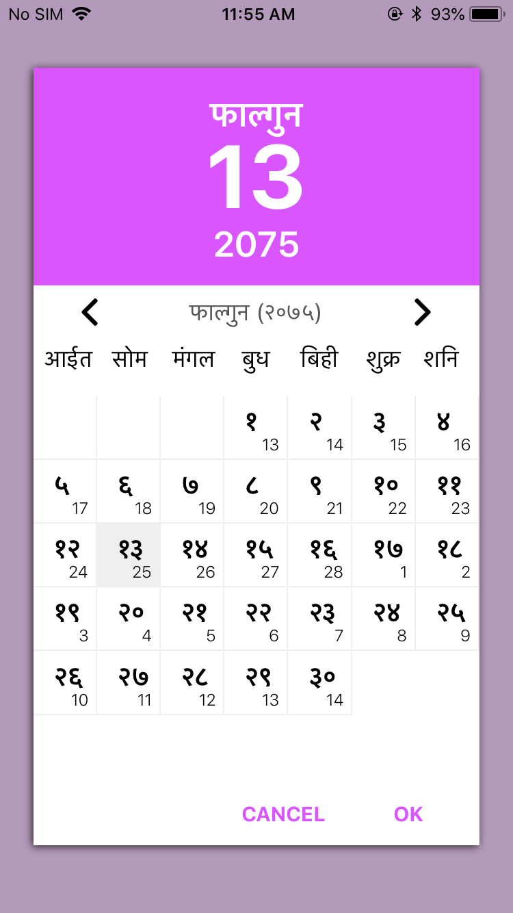
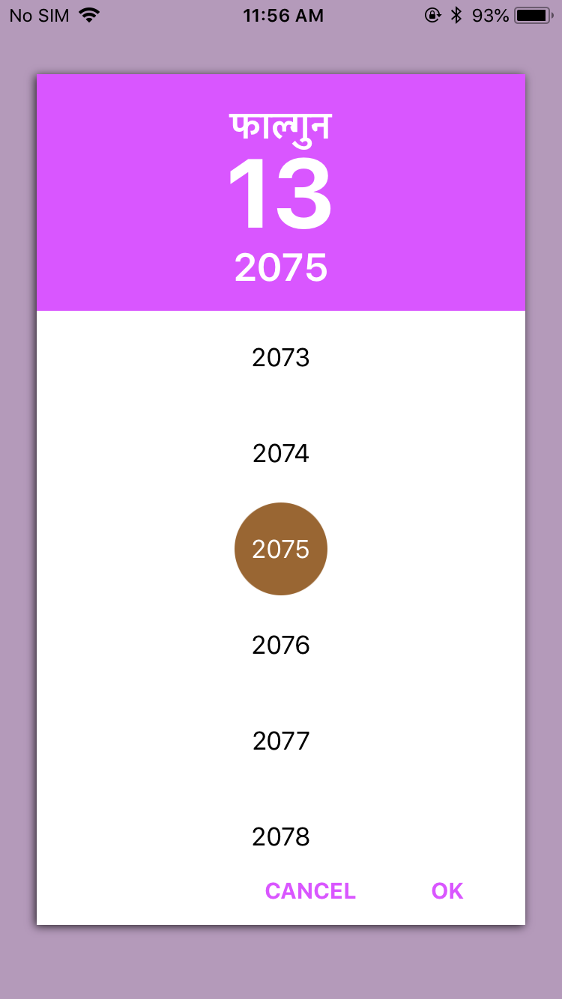

# NepaliCalender-Vikram-Samwat-

<p align="center">


</a>
</p>

### Features
- [x] Custom Picker based on Android Default Calender View
- [x] Easy convertable from Eng to nepali date and Vice versa 
- [x] very easily undetstable.
- [x] Easy presentation.
- [x] Pure Swift 4.2

## Select Date & Year

<div align = "center">

 
</div>

- Set and Confirm Protocol VSCalenderProtocol
```swift
class ViewController: UIViewController,VSCalenderProtocol
```
- Set Button actiion and delegate method 

```Swift
   // MARK: ------Button Action to open Calender
    @IBAction func btnOpenCalender(_ sender: Any)
    {
        VSCalender.show(view: self) // Call this method to show calender into you view controller
        
        // call converter method to convert any given english date to Nepali/Hindi date
        let Data = VSCalender.EngToNepDate(yy: 2019, mm: 02, dd: 22)
        
        print(Data.date)
        print(Data.month)
        print(Data.year)
        print(Data.hindiMonth)
    }
    
    // MARK: ------Delegates method (Hindi to english and vice versa)
    func selectedDate(date: Int, month: Int, year: Int, hindiMonthName: String)
    {
        print(date)
        print(month)
        print(year)
        print(hindiMonthName) // Got here selected Nepali/Hindi date with Hindi month name
    }
    
    func NepToEngDate(yy: Int, mm: Int, dd: Int) {
        print(yy)
        print(mm)
        print(dd) // Got here selected Nepali/Hindi date to english date
    }
   
